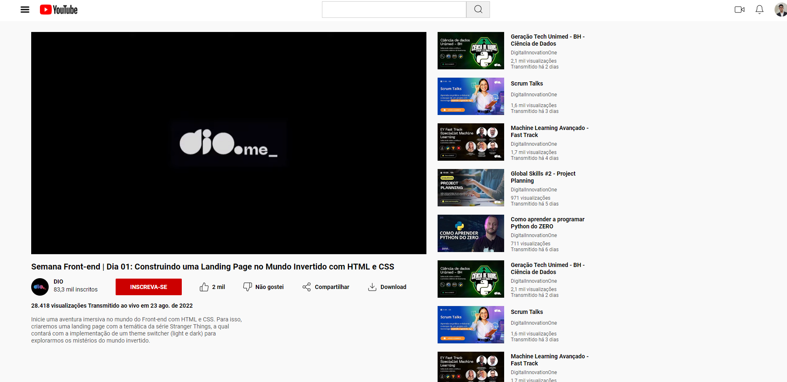

# TRILHA-CSS-Desafio-02-Clonando-a-Página-do-Youtube-com-CSS

Este projeto é um clone de uma página do YouTube, criado para estudo de HTML e CSS durante a Formação CSS da DIO. A interface foi baseada em um design do Figma e recriada utilizando técnicas de layout com Flexbox.

## Tecnologias Utilizadas

- **HTML5** para a estrutura.
- **CSS3** para estilização e layout responsivo.
- **Figma** como base para o design.

## Objetivo

Praticar a conversão de layouts de design em código, focando na organização visual e no uso de Flexbox.

## Preview

